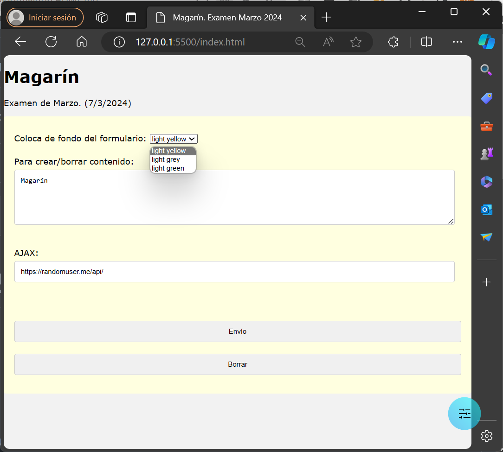
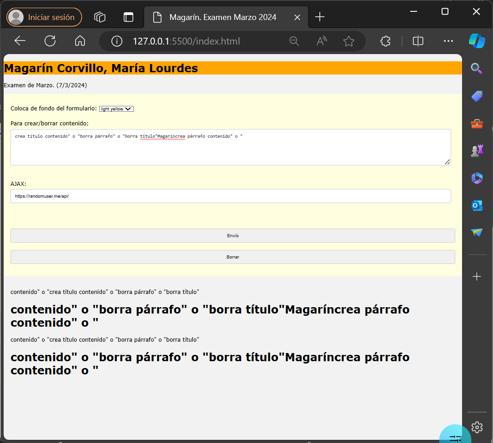

# Examen javaScript. Marzo 2024.

Sigue las siguientes instrucciones. 
- Prohibido el uso de la IA
- Utiliza los ficheros suministrados
- En el `index.html` que escribas no pueden usarse los atributos id, name, class...
- Sigue las buenas prácticas aprendidas durante el curso
- Utiliza la programación declarativa frente a la imperativa de JS (conciso, sin for clásicos...)
- Añade el hosting al título de este README

- Al cargar el DOM:
  - [ ] aparece el nombre completo del alumno en el textarea
  - [ ] aparece la url en el segundo input "https://randomuser.me/api/"
  - [ ] se sustituye en el párrafo el contenido del paréntesis por la fecha actual 

- En el select 
  - [ ] cambia el color del formulario en cada cambio de opción
  - [ ] usa el evento para obtenerlo
  - [ ] ejecuta el evento al cargar la página 
- En el input text, al perder el foco
  - [ ]  haz uso de la variable this para obtener la url ya escrita en el input
  - [ ]  se hace una solicitud AJAX a la url "https://randomuser.me/api/"
  - [ ]  del json devuelto se obtiene el país de la propiedad country
  - [ ]  se muestra por consola
- Mediante jQuery
  - [ ] añade el país (obtenido por AJAX) al primer div (justo delante de "Envío")
  - [ ] aplica la clase pais
  - [ ] al mover el ratón sobre el título se esconde y reaparece con un color de fondo (slow)  el nombre completo del alumno

- En el envío del formulario se añaden/eliminan párrafos y títulos al segundo div tras el formulario
  - [ ] Al enviar el formulario:
    - [ ] se captura el contenido del textarea y se ejecuta uno de los siguienes comandos:
         - [ ] `crea párrafo contenido`, que crea un párrafo con el contenido indicado por el usuario
         - [ ] `crea título contenido`, que crea un título con el contenido indicado por el usuario
         - [ ] `borra párrafo`, que borra todos los párrafos creados con anterioridad
         - [ ] `borra título`, que borra todos los títulos creados con anterioridad
    - [ ] en caso de no introducirse el formato correcto se muestra EXÁCTAMENTE este mensaje de error: `El formato correcto es "crea párrafo contenido" o "crea título contenido" o "borra párrafo" o "borra título"`

  - [ ] si el formato es correcto se crea/elimina del DOM y se borra el div del error

  - Con respecto a los comandos, algunas particularidades:
    - [ ] extrae los comandos mediantes grupos de captura
    - [ ] usa el destructuring
    - [ ] captura el error mediante excepciones
    - [ ] admitirá los comandos con y sin tildes (título y párrafo)
    - [ ] admitirá sólo el primer comando válido

      - [ ] pueden aparecer espacios o no antes y después de los comandos y elementos
      - [ ] el contenido puede estar vacío en `crea párrafo contenido` o `crea título contenido`, en cuyo caso aparece la hora actual
        